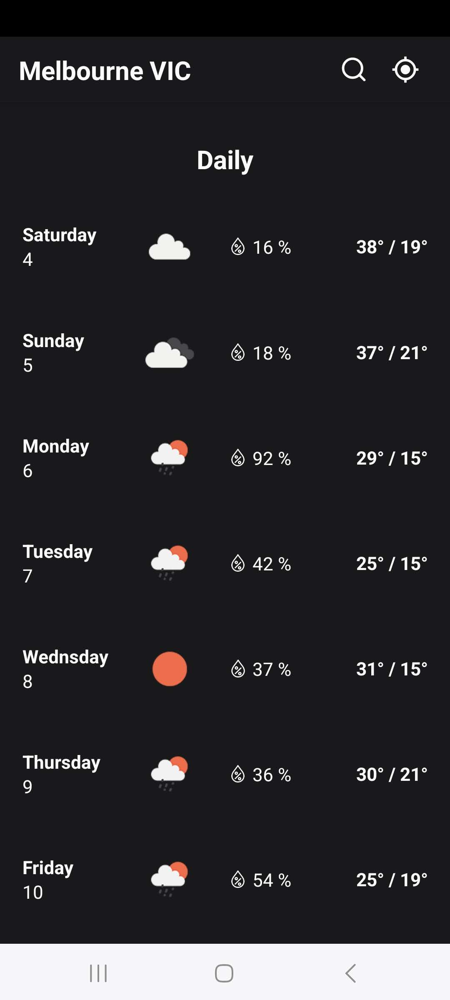
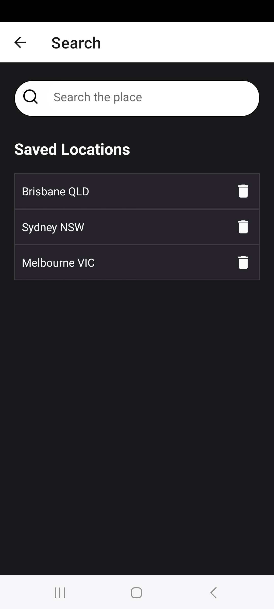

# Weather App
A project written in React Native displaying current weather and weather forecasts for the user-selected location using data from the OpenWeather API
## Screenshots
.
.
.
.
.
.

## Introduction
The React Native weather app features searching places, showing current weather and weather forecasts.  
It contains the following key features:
- Search place: search place through Google Places autocomplete feature
- Save locations: save searched locations to a database and allow user to select them to view the weather
- Current weather: display current weather and weather conditions for the user-selected location
- Hourly weather forecasts with a line chart
- Daily weather forecasts
- Current location: get user's current location from the device

## Technologies used
- React Native
- JavaScript
- Expo
- Expo SQLite
- Expo Location
- GooglePlacesAutocomplete library
- Google reverse geocoding API
- OpenWeather API

## Installation
To run this project, please follow the steps below
1. git clone the project
2. change directory: cd weather-app
3. install dependencies: npm install
4. create a .env file with your API keys including GOOGLE_PLACES_API_KEY and OPEN_WEATHER_API_KEY
5. run commend: npx expo start
6. follow the instructions from expo to run the app
